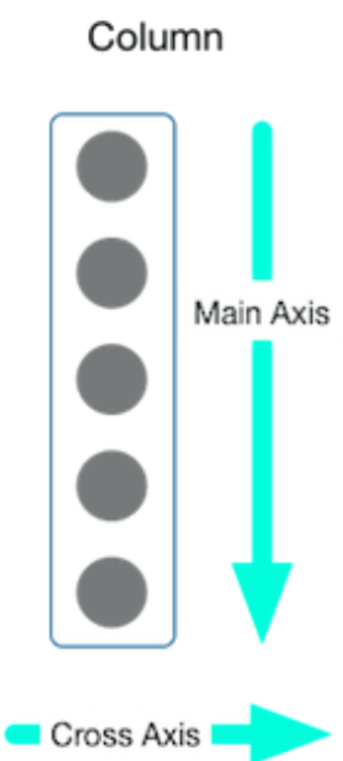
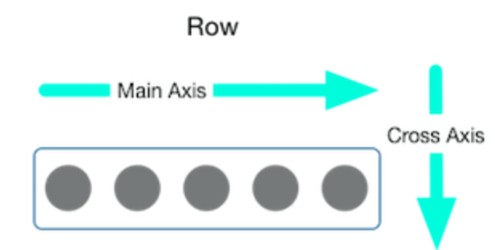
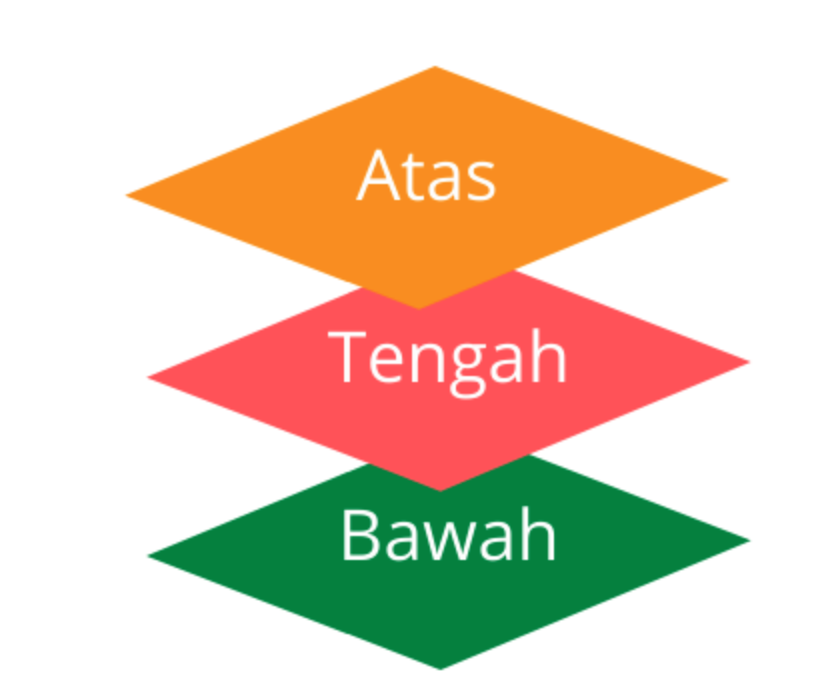
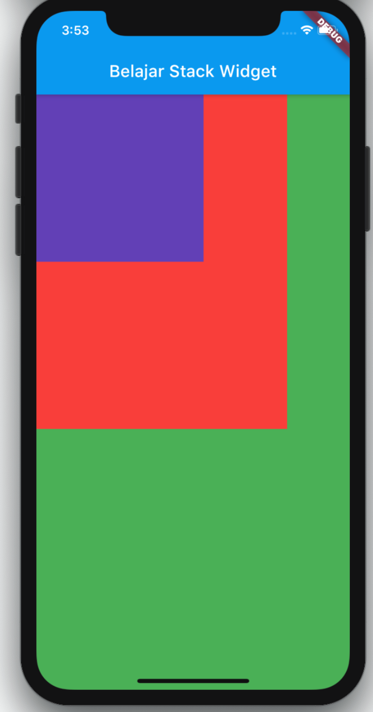

## Latihan 3

Pada pelatihan 3 ini akan membahas tentang widget lanjutan dari materi sebelumnya.
Untuk latihan 3 akan membahas tentang row, column, list view, stack, Navigation (In line code)

Jump to

- [Column](https://github.com/dikynugraha1111/bootcamp_uty/tree/master/lib/latihan_3#Column)
- [Row](https://github.com/dikynugraha1111/bootcamp_uty/tree/master/lib/latihan_3#Row)
- [List View](https://github.com/dikynugraha1111/bootcamp_uty/tree/master/lib/latihan_3#List-View)
- [Stack](https://github.com/dikynugraha1111/bootcamp_uty/tree/master/lib/latihan_3#Stack)
- [Navigation]()

### Column

Column adalah salah satu widget yang dapat menampung beberapa child sekaligus, atau yang kita sebut sebagai children. Widget ini akan membuat para children nya berjejer berurutan secara vertikal atau atas ke bawah.</br>
</br>
Pada widget ini terdapat properties mainAxisSize yang berfungsi untuk mengatur ukuran dari Column tersebut, by default ini akan berisikan max yang dimana artinya ukurannya akan mengikuti ukuran dari si parent nya, sedangkan jika kita atur menjadi min maka ukurannya akan mengikuti ukuran dari para children nya itu sendiri, ini sama halnya seperti match_parent dan wrap_content pada Android.

```
    Column(
        mainAxisSize: MainAxisSize.min,
        mainAxisAlignment: MainAxisAlignment.center,
        crossAxisAlignment: CrossAxisAlignment.start,
        children: <Widget>[
            FlutterLogo(size: 24),
            FlutterLogo(size: 36),
            FlutterLogo(size: 28),
            FlutterLogo(size: 20),
            FlutterLogo(size: 32),
        ],
    );
```

#### MainAxisAlignment

Properties ini berfungsi untuk mengatur alignment para children secara vertikal untuk Column dan secara horizontal untuk Row, mudahnya dia mengikuti direksi utama dari widget tersebut, pada Column adalah vertikal atau atas ke bawah dan Row secara horizontal atau kiri ke kanan.

#### CrossAxisAlignment

Properties ini adalah berkebalikan dari mainAxisAlignment, yaitu jika mainAxisAlignment pada Column untuk secara vertikal atau atas ke bawah, maka properties ini akan mengatur secara horizontal atau kiri ke kanan.

### Row

Widget ini sama hal nya dengan Column, namun jika Column berdirektori horizontal atau atas ke bawah, maka Row berdirektori utama vertikal atau kiri ke kanan.</br>
</br>

### List View

Cara penggunaan ListView ini mirip dengan Column atau Row di mana Anda memasukkan widget yang ingin disusun sebagai children dari ListView.
Hanya saja untuk widget List View sendiri anda bisa melakukan kustomisasi lebih detail dan banyak lagi, seperti menambahkan separator pada setiap item list view, direction dari list view, generate list view dari item, dan masih banyak lagi.
Disini kita akan membahas 2 macam list view, yaitu List View secara secara default (ListView) dan juga List View yang itemnya di generate dari list data tertentu (ListView.builder atau ListView.generate)

### Stack

Stack widget memungkinkan kita untuk menampilkan beberapa lapis widget ke layar. Stack widget juga merupakan multiple children widget yang artinya memiliki properti children sehingga dapat menampung lebih dr satu widget. Urutan dari lapisan widget pada stack dari bawah ke atas, jadi widget yang pertama di dalam stack akan berada di posisi paling bawah dan begitu juga sebaliknya, widget yang terakhir di stack widget akan berada di posisi paling atas stack.</br>
</br>

```
        body: Stack(
          children: <Widget>[
            Container(
              color: Colors.green,
            ),
            Container(
              color: Colors.red,
              height: 400.0,
              width: 300.0,
            ),
            Container(
              color: Colors.deepPurple,
              height: 200.0,
              width: 200.0,
            ),
          ],
        ),
```

</br>
